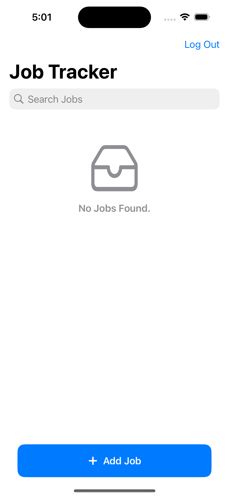
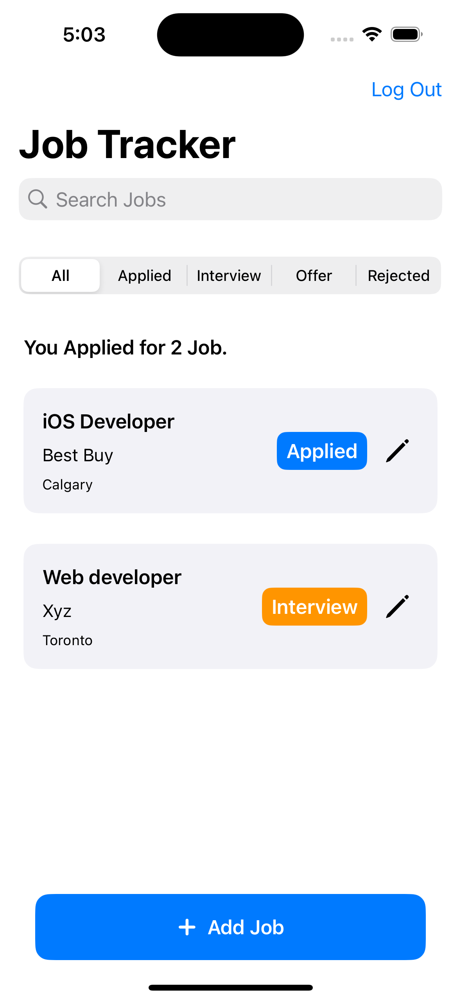
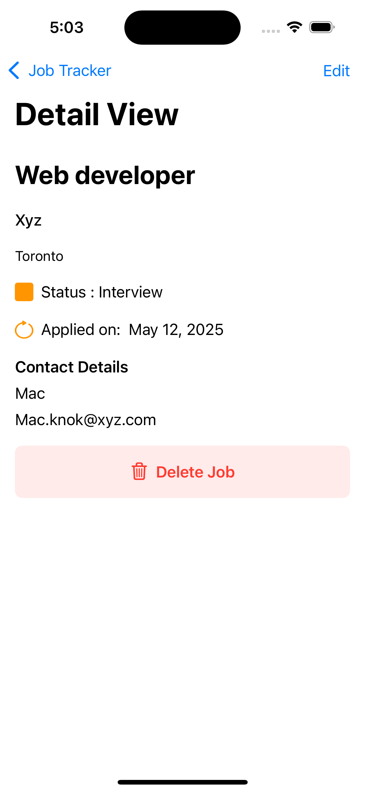
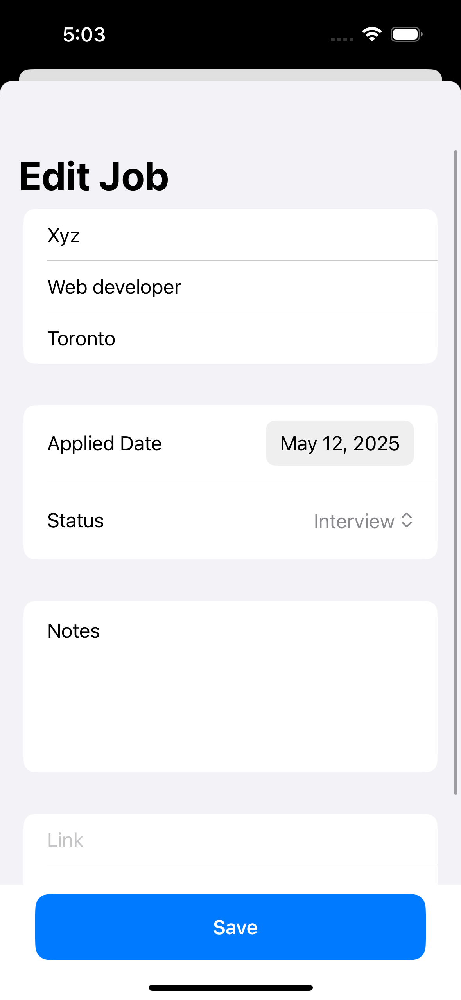
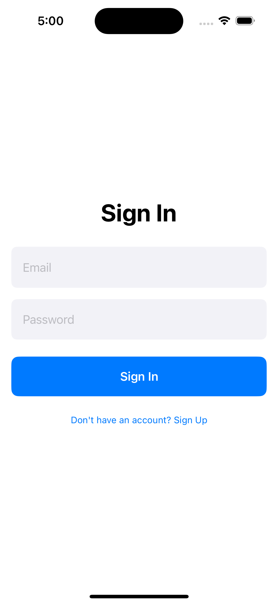
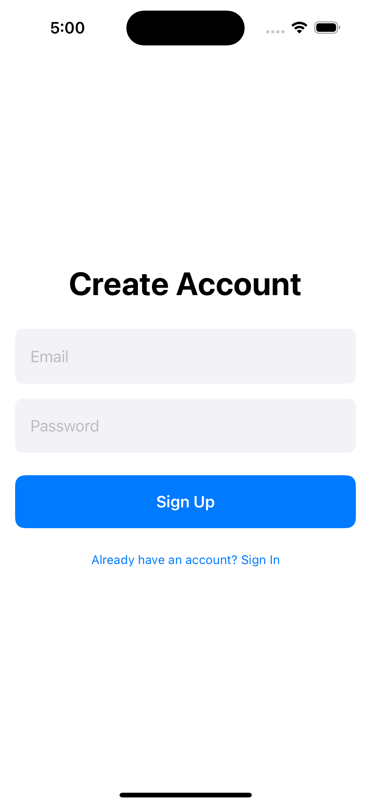

# 👨‍💼 JobTracker – Track Your Job Applications with Ease

**JobTracker** is a SwiftUI-based iOS app designed to help job seekers manage and track their job applications in one place. Whether you’re actively applying or passively exploring, JobTracker provides an intuitive interface to log applications, monitor progress, and stay organized throughout the job hunt.

---

## 🚀 Features

- 🧾 **Track Applications:** Add job details like company, position, location, date applied, and application status.
- 📌 **Status Tags:** Visually mark jobs as *Applied*, *Interview*, *Offer*, or *Rejected* using color-coded tags.
- 🔁 **Edit & Delete:** Update or remove job entries as your process evolves.
- 🔐 **User Authentication:** Secure login & signup with Firebase Authentication.
- ☁️ **Realtime Sync:** Store and sync application data using Firestore — scoped per user.
- 🧼 **Clean Design:** Built with SwiftUI and MVVM architecture for a responsive and maintainable UI.

---

## 🧠 Tech Stack

- `SwiftUI` + `MVVM`
- `Firebase Auth` + `Firestore`
- `Async/await` for Firestore CRUD
- Modular SwiftUI components

---

## 📸 Screenshots

| Home | Job List | Add Job |
|------|----------|---------|
|  |  |  |

| Edit Job | Login | Signup |
|----------|-------|--------|
|  |  |  |

---

## 🛠 How to Run

1. Clone the repo  
2. Open `JobTracker.xcodeproj` in Xcode  
3. Add a `GoogleService-Info.plist` for Firebase
4. Run on iOS Simulator (iOS 16 or higher)
